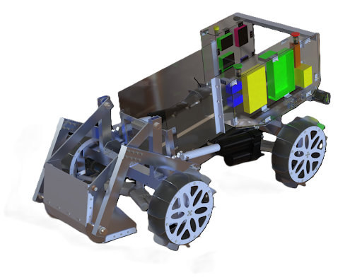

# Laptop Control Station Dasboard

**Laptop Dashboard for connecting to and controlling rover over websocket**

---

## Workspace Layout

<pre>
RAN-2025-26-Dashboard/
├── Laptop Dashboard
│   ├── README.md
│   ├── requirements.txt
│   ├── run_dashboard.ps1
│   ├── server
│   │   ├── app.py
│   │   ├── laptop_teleop_client.py
│   │   └── __pycache__
│   │       ├── realsense_source.cpython-313.pyc
│   │       └── telemetry_source.cpython-313.pyc
│   ├── start_dashboard.py
│   ├── web
│   │   ├── app.js
│   │   ├── components
│   │   │   ├── connection-bar.js
│   │   │   ├── controller-panel.js
│   │   │   ├── queue-panel.js
│   │   │   ├── rover-visual-panel.js
│   │   │   ├── telemetry-panel.js
│   │   │   ├── teleop-panel.js
│   │   │   └── video-panel.js
│   │   ├── example.png
│   │   ├── gamepad.js
│   │   ├── index.html
│   │   ├── main.js
│   │   └── style.css
│   └── wire_protocol.txt
└── readme.md
</pre>

---

## Running the System

To start the web server run:

```bash
python "Laptop Dashboard"/start_dashboard.py
```
   
To start the pi dashboard run:

```bash
ros2 run dashboard dashboard
```
    
_OPTIONAL: For the camera stream if you have a realsense camera hooked up run:_ 

```bash
ros2 run dashboard camera
```

---

## Authors

Benji Sutton

Jacob Earl

Royce Doll

---
